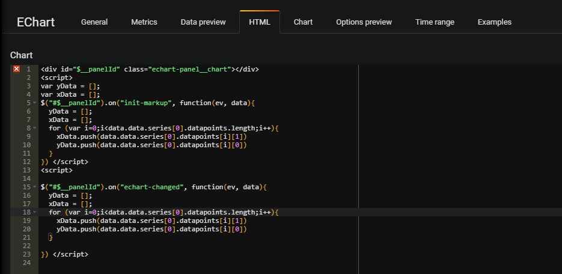
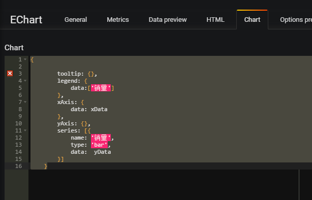

# grafana-echart-panel

Grafana plugin panel for echart graphs.

## Graph tab
Edit graph options

## Html tab
Edit Html and javascript in panel to transfer data

## Chart tab
Edit Option to define the data

## Data preview
This tab shows the available information at the `data` variables.
Refer to this `data` on your echart options to access to your metric values.

## Options preview
This tab shows the options as will be pass to echart

